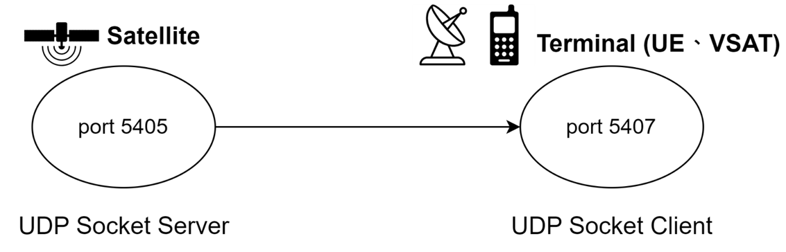

# 實驗 2：無損與有損 UDP 傳輸

[English](README.md) | [繁體中文](README.zh-TW.md)

此資料夾以 UDP 模擬衛星傳輸。

1. **EXP_1**：無損傳輸（有線路徑，不經過 Proxy）
2. **EXP_2**：有損傳輸（Proxy 注入延遲與丟包）

## 拓樸

無損（EXP_1）：



有損（EXP_2）：


## 檔案說明

| 路徑 | 用途 |
| --- | --- |
| `EXP_1/server.py`、`EXP_1/server.sh` | 傳送 `Hello 1` … `Hello 100` 給 Client |
| `EXP_1/client.py`、`EXP_1/client.sh` | 綁定埠 `5407` 並印出收到的訊息 |
| `EXP_2/server.py`、`EXP_2/server.sh` | 送給 Proxy，並寫入 `exp2_server.csv` |
| `EXP_2/proxy.py`、`EXP_2/proxy.sh` | 以 `-t` 延遲、`-l` 丟包後轉發 |
| `EXP_2/client.py`、`EXP_2/client.sh` | 接收並寫入 `exp2_client.csv` |
| `EXP_2/exp2_result.py` | 比對時間戳，繪製延遲／丟包圖 |

## 快速開始

安裝 python3 的虛擬環境套件後，建立虛擬環境 `env`。先啟用環境 `env`，在於虛擬環境內相關的套件。

```bash
sudo apt update
sudo apt install python3-venv
python3 -m venv env
pip3 install -r ../requirements.txt
```

完整步驟請看手冊：

- 單機（同一網卡加第二個 IP）：[manual-single.zh-TW.md](docs/manual-single.zh-TW.md)
- 雙機：[manual-dual.zh-TW.md](docs/manual-dual.zh-TW.md)

## 埠號

| 行程 | 埠 |
| --- | --- |
| Server | `5405` |
| Proxy（僅 EXP_2） | `5406` |
| Client | `5407` |
