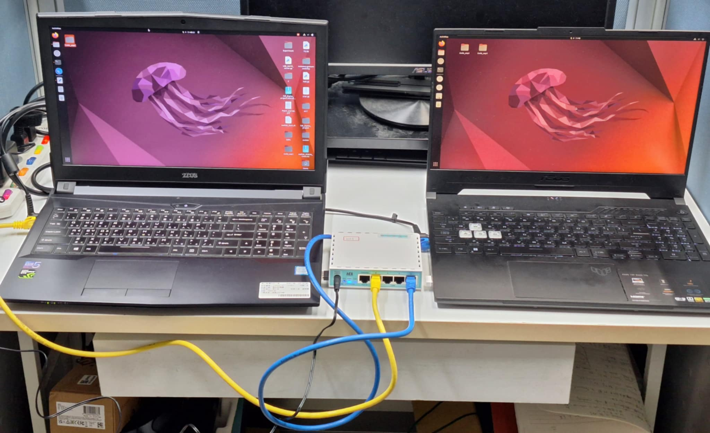
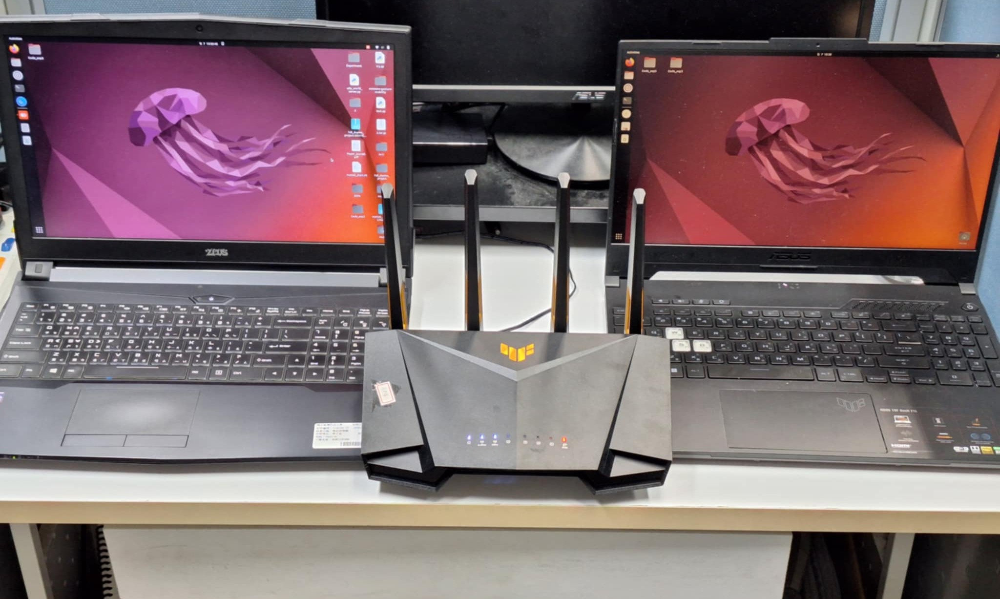
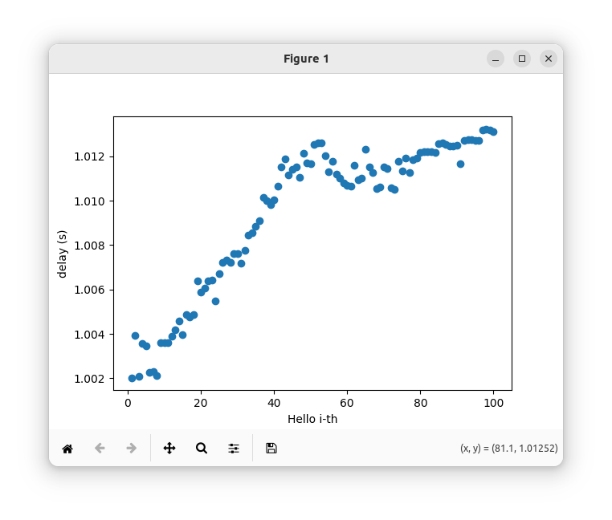
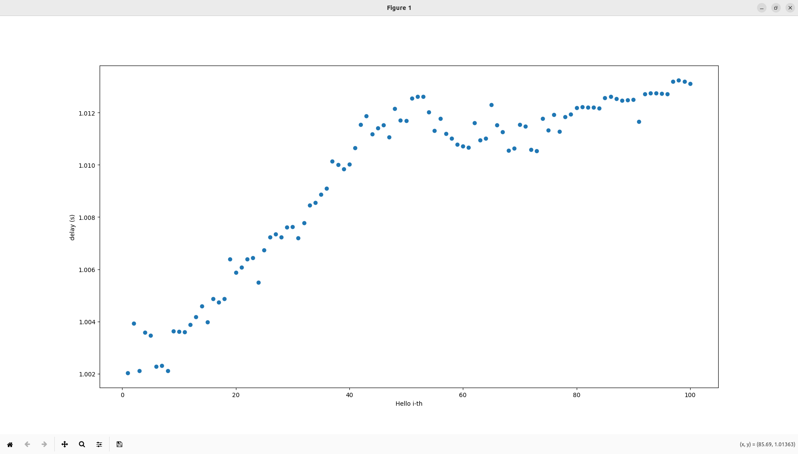

# 實驗 2 — 雙機版手冊

[English](manual-dual.md) | [繁體中文](manual-dual.zh-TW.md)

使用兩台 Ubuntu 筆電。實驗 1 以 Ethernet Hub 有線連接；實驗 2 走 Wi-Fi AP。可以兩台各自操作，或從 Client 用 SSH 控制 Server。

## Wireshark 安裝（選用）

透過 apt 指令 (Ubuntu/Debian) 安裝 wireshark 後，重新安裝具有免 root 權限抓包的功能。

```bash
sudo apt install wireshark
sudo dpkg-reconfigure wireshark-common
```

允許一般使用者抓封包時選 **Yes**。接著把目前使用者加入 `wireshark` 群組，並用 `newgrp` 立刻套用（否則要登出再登入）：

```bash
sudo usermod -aG wireshark $USER
newgrp wireshark
wireshark
```

開啟後選擇承載實驗流量的網卡，再進 **Statistics → I/O Graphs**。

## Experiment 1: Lossless data transmission（無損傳輸）

**目標：** 在單純有線路徑上傳送 UDP（不經 Proxy），觀察無損傳輸。

**設備：**

- Linux 筆電 × 2
- Ethernet Hub × 1
- 網路線 × 2

**拓樸圖**


**範例圖：雙機有線實體連接**



| 角色 | UDP 埠 |
| --- | --- |
| Server（衛星） | `5405` |
| Client（終端） | `5407` |

### 步驟（兩台各自操作）

1. 兩台筆電都關閉 Wi-Fi，只走有線連接。
2. 使用以下指令查詢 IP 及使用的 Interface：

```bash
ip a
```

僅供參考，請用你自己的位址：

| 機器 | 範例 IP | 範例網卡 |
| --- | --- | --- |
| Server | `192.168.10.250` | `ens33` |
| Client | `192.168.10.77` | `enp3s0f1` |

3. 在 **Client** 開 Wireshark，選對應網卡。
4. 使用 `ping` 測試與 Server 連接狀態：

```bash
ping -c 5 <SERVER_IP>
```

5. 兩邊都進入 `Code_exp2/EXP_1`，先執行 Client 程式，再於 Server 執行 Server 程式：

```bash
bash client.sh -c <CLIENT_IP>
bash server.sh -s <SERVER_IP> -c <CLIENT_IP>
```

可加發送間隔（秒，預設 `1`）：

```bash
bash server.sh -s <SERVER_IP> -c <CLIENT_IP> -t 1
```

6. 在 Wireshark 設定以下過濾器，使用 **I/O Graphs** 觀察結果：

```text
udp && ip.src==<SERVER_IP> && ip.dst==<CLIENT_IP>
```

### 預期結果

- Server 印出 `Hello 1` … `Hello 100` 與 `the latency is 1.0 s`。
- Client 依序收到全部訊息。
- I/O Throuput 圖從閒置跳升至 1 pkt/s，並在傳送期間維持穩定速率。

### 改用 SSH 操作

兩台都安裝 OpenSSH：

```bash
sudo apt update
sudo apt install ssh -y
```

從 Client：

```bash
ssh <USER>@<SERVER_IP>
cd /path-to/Code_exp2/EXP_1
```

本機終端機跑 Client，SSH 視窗跑 Server，指令與上面相同。

> [!WARNING]
> 請更改教材上面的路徑為你實際 clone 的位置。

### 示範影片

- [SSH 版](https://youtu.be/7__p9velytY)
- [兩台各自操作](https://youtu.be/W1oNWTd6RF8)

---

## Experiment 2: Lossy data transmission（有損傳輸）

**目標：** 兩台電腦使用 Wi-Fi 的方式進行連接，並用 Proxy 加入延遲與丟包，以模擬現實中無線鏈路及衛星鏈路的有損傳輸特性，使實驗結果更貼近真實環境。

**設備：**

- Linux 筆電 × 2
- Wi-Fi AP × 1

筆電 1 跑 **Server**。筆電 2 開兩個終端機跑 **Client** 與 **Proxy**。

**拓樸圖**


**範例圖：雙機無線實機**



| 角色 | UDP 埠 |
| --- | --- |
| Server | `5405` |
| Proxy | `5406` |
| Client | `5407` |

在 Client 筆電上，Proxy IP 與 Client IP 相同。

### 步驟

1. 兩台筆電都連上同一個 AP。
2. 使用以下指令查詢 IP 及使用的 Interface。

```bash
ip a
```

3. 可選：兩台安裝 `ssh`，從 Client 遠端進入 Server 的資料夾：

```bash
ssh <USER>@<SERVER_IP>
cd /path-to/Code_exp2/EXP_2
```

4. 抓包請選 Wi-Fi 網卡（若只看本機 Proxy→Client，可用 `lo`）。
5. 在 **Client 筆電** 的 `Code_exp2/EXP_2`：

```bash
bash client.sh -c <CLIENT_IP>
bash proxy.sh -p <PROXY_IP> -c <CLIENT_IP> -t <DELAY_S> -l <LOSS_RATE>
```

`-t` 為延遲秒數，`-l` 為丟包機率（`0`–`1`）。預設 `-t 1`、`-l 0`。

6. 在 **Server**：

```bash
bash server.sh -s <SERVER_IP> -p <PROXY_IP>
```

### 預期結果

- Server 印出每個 Hello。
- Proxy 先延遲，再轉發（結果 `1`）或丟棄（結果 `0`）。
- Client 會看到不連續的編號。

### 紀錄與繪圖

CSV 分別寫在各機器的 `EXP_2`（Server 有 `exp2_server.csv`，Client 有 `exp2_client.csv`）。把 Server 的 CSV 拷到 Client（USB、Email 或 `scp`）：

```bash
scp exp2_server.csv <USER>@<CLIENT_IP>:/path/to/Code_exp2/EXP_2/
```

在 Client：

安裝 python3 的虛擬環境套件後，建立虛擬環境 `env`。先啟用環境 `env`，再於虛擬環境內安裝 matplotlib。

```bash
sudo apt update
sudo apt install python3-venv
python3 -m venv env
source ./env/bin/activate
pip3 install matplotlib
```

在終端機中執行以下指令，觀察實驗的執行結果。

```bash
python3 exp2_result.py
```

輸出：每個封包的延遲或丟包、`exp2_result.csv`、以及 `exp2_result.png`（橫軸：封包編號；縱軸：延遲秒；丟包為空白）。





> [!NOTE]
> 圖形分佈主要受丟包率影響。

### 示範影片

- [SSH 版](https://youtu.be/vreE52qI2y0)
- [兩台各自操作](https://youtu.be/4_SLUV8H_1M)
