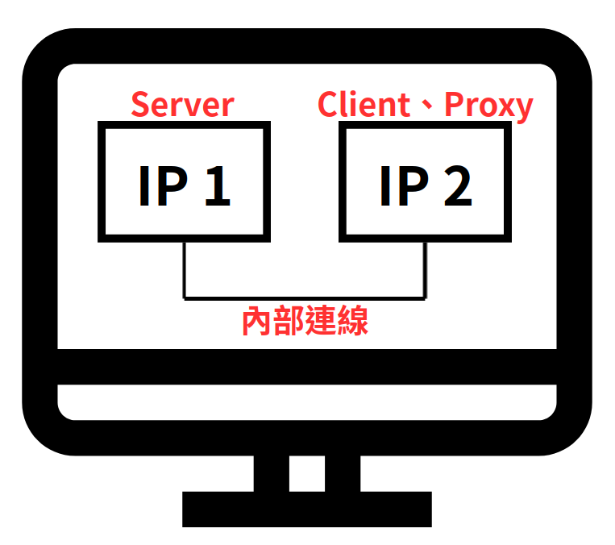
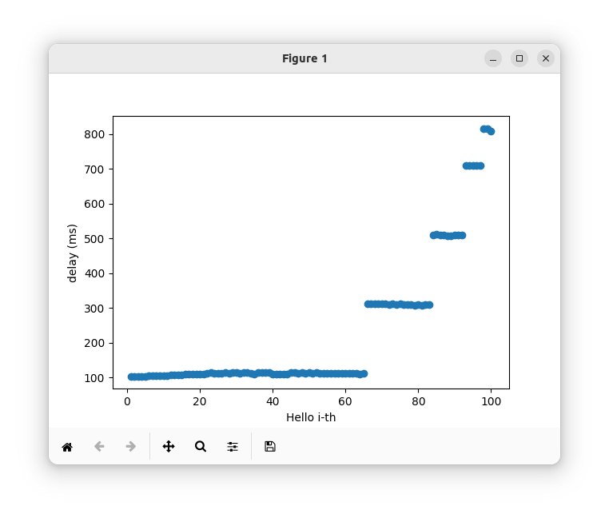
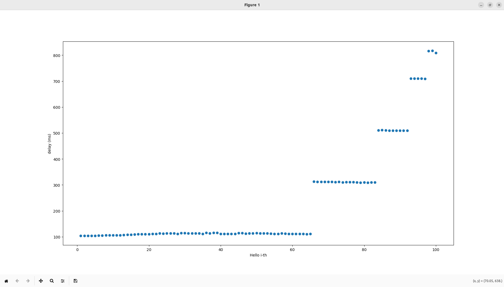

# 實驗 3 — 單機版手冊

[English](manual-single.md) | [繁體中文](manual-single.zh-TW.md)

> [!NOTE]
> 在**同一台** Ubuntu 電腦跑 Server、Proxy、Client。在同一張網卡新增第二個 IP。不需要 AP。



## 實驗概念

封包經 **Gateway** 以 FIFO 轉發。端到端延遲由**仰角 θ**（整數，°）。執行過程中，每兩個封包共用同一仰角，從 90° 起隨封包序號遞減。`proxy.sh` 依封包區間套用毫秒級延遲（約 4–5 ms），`proxy_new.sh` 將同一趨勢放大至 100–800 ms。

## 前置步驟

使用以下指令查詢 IP 及使用的 Interface：

```bash
ip a
```

僅供參考，請用你自己的位址：

| 角色 | 範例 |
| --- | --- |
| Server IP | `192.168.0.225` |
| 網卡名稱 | `ens33` |
| Client / Proxy IP | `192.168.0.226` |

```bash
sudo ip addr add <CLIENT_IP>/24 dev <NIC_NAME>
```

用 `ip a` 確認，再測試連線：

```bash
ping -c 3 -I <NIC_NAME> <CLIENT_IP>
ping -c 3 -I <NIC_NAME> <SERVER_IP>
```

若做實驗 2 時已經加過 IP，可跳過前置步驟。

## 拓樸

**拓樸圖**


| 角色 | UDP 埠 |
| --- | --- |
| Server（衛星） | `5405` |
| Proxy（閘道，FIFO + 仰角延遲） | `5406` |
| Client（終端） | `5407` |

單機模式下 Client IP 與 Proxy IP 是同一個額外位址。

## 步驟

在 `Code_exp3` 目錄，依序於 **Client → Proxy → Server** 執行腳本：

```bash
bash client.sh -c <CLIENT_IP>
bash proxy.sh -p <PROXY_IP> -c <CLIENT_IP>
bash server.sh -s <SERVER_IP> -p <PROXY_IP>
```

若要換成另一個 Gateway（`proxy_new.py`）而不是 `proxy.py`：

```bash
bash proxy_new.sh -p <PROXY_IP> -c <CLIENT_IP>
```

| 腳本 | Gateway | 延遲量級 |
| --- | --- | --- |
| `proxy.sh` → `proxy.py` | Gateway A | 依封包區間，約 4.00–4.96 ms |
| `proxy_new.sh` → `proxy_new.py` | Gateway B | 同一仰角趨勢，100–800 ms |

仰角公式與對照表見 [README.zh-TW.md](../README.zh-TW.md)。

## 預期結果

- Server 依 FIFO 順序送出 `Hello 1` … `Hello 100`。
- Proxy 印出每個封包與對應延遲（毫秒）。
- Client 印出收到的 Hello。因為是 FIFO，順序仍連續；延遲曲線隨仰角下降而上升。

## 紀錄與繪圖

CSV 會寫在 `Code_exp3`（`exp3_server.csv`、`exp3_client.csv`）。接著：

```bash
pip3 install matplotlib
python3 exp3_result.py
```

程式以**毫秒**印出延遲，寫入 `exp3_result.csv`，並儲存 `exp3_result.png`（橫軸：封包編號；縱軸：延遲 ms）。換 `proxy_new.sh` 再跑一次，延遲曲線應呈現更明顯的上升趨勢。





## 示範影片

[單機 FIFO 示範](https://youtu.be/H_3eXnDWkdg)
