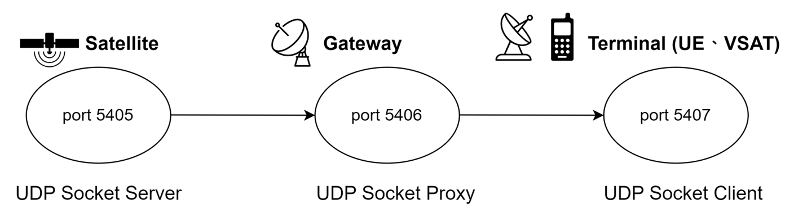

# 模組系列三：低軌衛星通訊網路之實驗模組

[English](README.md) | [繁體中文](README.zh-TW.md)

以 UDP 模擬衛星到地面終端的資料傳輸實驗：對比無損／有損鏈路，以及在不同 Gateway 仰角所對應的延遲下以 FIFO 轉發的傳輸。

## 下載程式

[點選這邊](https://github.com/wise-ntust/LEO-satellite-comm-MOD/releases/download/v1.0.0/LEO-satellite-comm-MOD-v1.0.0.zip) 下載最新的程式碼。

## 專案說明

各實驗以 UDP socket 扮演衛星、可選閘道、以及地面終端：



| 角色 | 實驗中的意義 | UDP 埠 |
| --- | --- | --- |
| Server | 衛星發送端 | `5405` |
| Proxy | 閘道（延遲／丟包／FIFO） | `5406` |
| Client | 地面終端接收端 | `5407` |

實驗 2-1（無損）不經過 Proxy，由 Server 直接送到 Client。

## 功能

- 有線路徑上的無損 UDP 傳輸，可用 Wireshark I/O Graphs 觀察吞吐量
- 透過 Proxy 注入延遲與丟包，模擬有損傳輸
- 以 FIFO 轉發模擬低軌衛星，延遲隨仰角下降而增加
- 單機模式（同一網卡加第二個 IP）與雙機模式（Ethernet Hub 或 Wi-Fi AP）
- Proxy 類實驗會寫 CSV，並用 `matplotlib` 畫延遲圖

## 倉庫結構

```text
.
├── Code_exp2/          # 端對端傳輸實驗
│   ├── EXP_1/          # Server → Client（無 Proxy）
│   ├── EXP_2/          # Server → Proxy → Client
│   └── docs/           # 單機版與雙機版手冊
├── Code_exp3/          # 排程機制於低軌衛星通訊傳輸實驗
│   └── docs/
├── docs/assets/        # 拓樸照片與範例結果圖
├── LICENSE
└── requirements.txt
```

## 環境需求

- Ubuntu 22.04 以上
- Python 3
- [matplotlib](https://matplotlib.org/)（延遲繪圖：`pip install -r requirements.txt`）
- Wireshark（選用，抓封包與 I/O Graphs）
- OpenSSH（選用，雙機遠端操作）

## 快速開始

選一個實驗，再開對應手冊。

| 實驗 | 目標 | 單機版 | 雙機版 |
| --- | --- | --- | --- |
| [Code_exp2](Code_exp2/README.zh-TW.md) EXP_1 | 無損 UDP | [手冊](Code_exp2/docs/manual-single.zh-TW.md#experiment-1-lossless-data-transmission無損傳輸) | [手冊](Code_exp2/docs/manual-dual.zh-TW.md#experiment-1-lossless-data-transmission無損傳輸) |
| [Code_exp2](Code_exp2/README.zh-TW.md) EXP_2 | 有損 UDP（經 Proxy） | [手冊](Code_exp2/docs/manual-single.zh-TW.md#experiment-2-lossy-data-transmission有損傳輸) | [手冊](Code_exp2/docs/manual-dual.zh-TW.md#experiment-2-lossy-data-transmission有損傳輸) |
| [Code_exp3](Code_exp3/README.zh-TW.md) | FIFO + 仰角延遲 | [手冊](Code_exp3/docs/manual-single.zh-TW.md) | [手冊](Code_exp3/docs/manual-dual.zh-TW.md) |

單機範例（實驗 2-1，已加上第二個 IP 之後）：

```bash
cd Code_exp2/EXP_1
bash client.sh -c <CLIENT_IP>
bash server.sh -s <SERVER_IP> -c <CLIENT_IP>
```

請改成你自己的 IP。預設發送間隔為 1 秒（可用 `-t` 調整）。

## 文件

- [實驗 2 README](Code_exp2/README.md) · [中文](Code_exp2/README.zh-TW.md)
- [實驗 3 README](Code_exp3/README.md) · [中文](Code_exp3/README.zh-TW.md)

## 示範影片

各實驗之實驗步驟及範例結果的 YouTube 錄影連結皆於對應實驗手冊中。

## 貢獻

歡迎開 Issue 或 Pull Request。請註明實驗資料夾（`Code_exp2` / `Code_exp3`）、單機或雙機，以及實際執行的指令。

## 致謝

1. 本專案為[教育部下世代行動通訊技術人才培育計畫](https://proj.moe.edu.tw/B5GMOE/Default.aspx)之[低軌衛星通訊非地面網路跨層次系統整合教學聯盟課程](https://5grf.ntust.edu.tw/)模組三成果
2. 謝謝黃琴雅、林詩涵、許應詰、周名初、利晉霆與所有 WISE LAB 成員對本專案的貢獻，讓專案得以順利完成。


## 授權

本專案使用 [MIT License](LICENSE)。
